# Supported Engines
* RPGM Games
* Text Files
* Certain VN Engines (Renpy, Tyrano, Kirikiri, etc.)

# Overview
This is a translation tool that can be used to translate games, specifically text files from games, and the tool will handle most of the hard work. There is no GUI at the moment; everything is done through the command line. This tool mainly uses GPT for translation, but it can be configured with other models as long as they share the same format.

# Setup
Note that this will likely require a bit of programming experience or the motivation and time to learn. This will also assume you are using Windows 11 (though it should work on Windows 10 as well).

## Tools
* [VSCode](https://code.visualstudio.com/) - Code Editor I use. **During installation, enable the following:**
  - Add "Open with Code" action to Windows Explorer file context menu
  - Add "Open with Code" action to Windows Explorer directory context menu

* [Python & Pip](https://www.python.org/downloads/) - Language. Google guides if pip isn't found in later steps.
* [Git](https://git-scm.com/) - Version Control. It will show you what has been changed. Amazing for translation. You may also need to set up your [credentials](https://docs.github.com/en/get-started/getting-started-with-git/setting-your-username-in-git), which can be whatever you want.
* [GPT API Account](https://platform.openai.com/playground/chat) - You will need to create an [API Key](https://platform.openai.com/settings/organization/api-keys).

You will know Python and Git are installed properly by opening a command prompt or terminal and typing the following:

```shell
python -V
git -v
```

It will display the version.

## Setup Environment

### 1. Open Project in VSCode

1. Create a new folder where the tool will live.
2. Download the ZIP by clicking CODE at the top.
3. Extract the ZIP into the folder.
4. Shift + Right Click and select "Open with Code".

   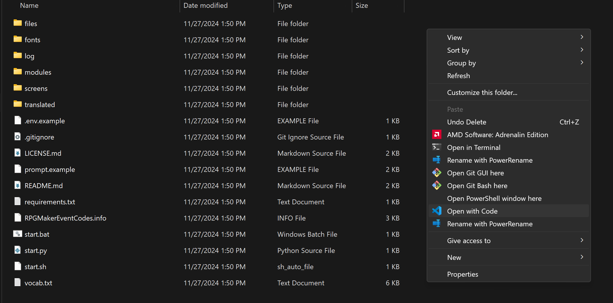
5. You should now have the project open in VSCode.

   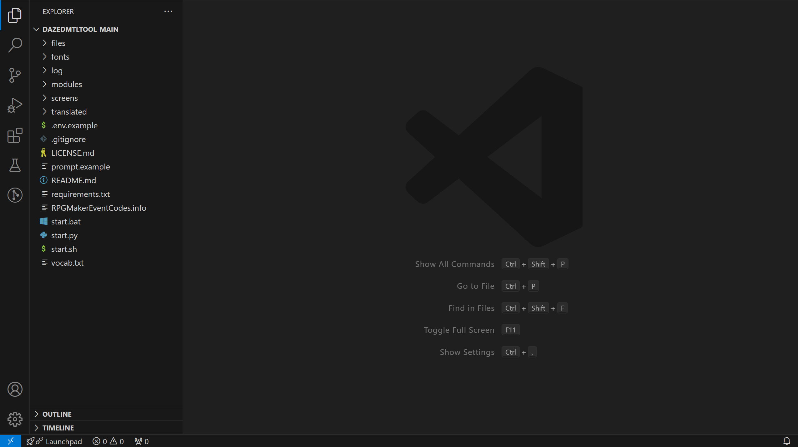

### 2. Install Dependencies

1. Click View > Terminal.
2. Type the following command to install dependencies:
   
   ```shell
   pip install -r requirements.txt
   ```

### 3. Setup .env

1. Copy `.env.example` and rename it to `.env`.
2. Open `.env` and enter your [GPT API Key](https://platform.openai.com/settings/organization/api-keys) and [Organization Key](https://platform.openai.com/settings/organization/general).
3. The rest of the ENV is where you will set things like wordwrap for game text.

That will about wrap it up for setup.

### 4. Setup Prompt

1. Create a file named `prompt.txt`.
2. Copy what is in `prompt.example` and place it inside `prompt.txt`. You can change this, but I would mostly leave it the same.

## Translation

`modules` contains the scripts needed to actually translate each game engine. For example, `rpgmakermvmz.py` is for translating RPG Maker MV and MZ games. I am going to go step by step into my process. This will hopefully give you an idea of how you should approach AI Translation of a game.

### 1. Setup Formatting

1. Navigate to the game folder (where game.exe is).
2. Shift + Right Click and select "Open in Code".
3. Press `CTRL+SHIFT+X` and type `JSON formatter`. I recommend the one by Clemens Peters, but choose whichever works.
4. Navigate to the `www` folder and right-click `data`. Then click `Format`. This will format all the files and make them look pretty for editing.

   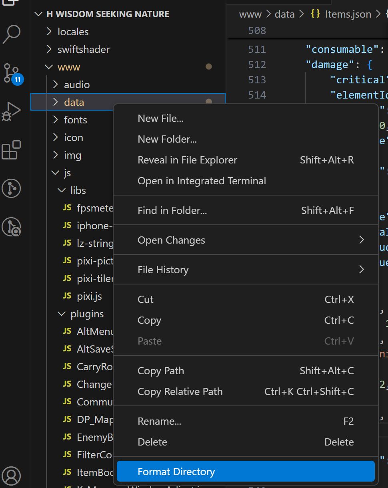

### 2. Setup Version Control

This is going to help us track changes we make while translating. It is extremely helpful, and I do not recommend skipping it.

1. Press `CTRL+SHIFT+X` and type `Gitlens`. Install the extension.
2. Create a new file `.gitignore` in the game directory and add the following to it:

   ```plaintext
   # Ignore all files
   *.*
   # File Types
   !*.mps
   !*.dat
   !*.json
   !*.txt
   !*.project
   !*.js
   !*.zip
   !*.7z
   !*.csv
   !*.ain
   !*.fnl
   !*.ks
   !*.tjs
   !*.yaml
   !*.rb
   !*.rvdata2
   # Other Needed Files
   !.gitignore
   !README.md
   !patch-config.txt
   !GameUpdate*
   !patch*
   !Game.dat
   # Ignore
   previous_patch_sha.txt
   kabe3_save.dat
   kabe3_system.dat
   psbpack.dat
   Save*
   ```

This will ignore files we don't care about.

3. Click the source control button on the left (or hit `CTRL+Shift+G` -> `G`).
4. Click "Initialize Repository". This is going to create a new repo that will track all changes. You will see them pop up after.
5. `Committing` a change is a lot like saving them. Type `Initial Commit` in the message box and hit the commit button to save changes.

   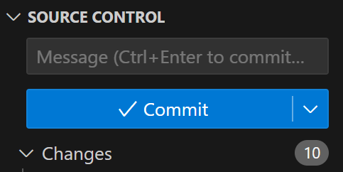
6. Now, our changes are saved, but we will want them saved on another branch as well, so we can compare them later. Press `CTRL+Shift+P` -> Type "Create Branch" -> Type `original` and hit Enter.
7. Press `CTRL+Shift+P` -> Type "Checkout" -> `main` or `master`.
8. Navigate to Source Control on the left, click Gitlens at the bottom, and select the branch icon. A checkmark should be next to your main branch.

When we make changes later, you will be able to directly compare them with the original files.

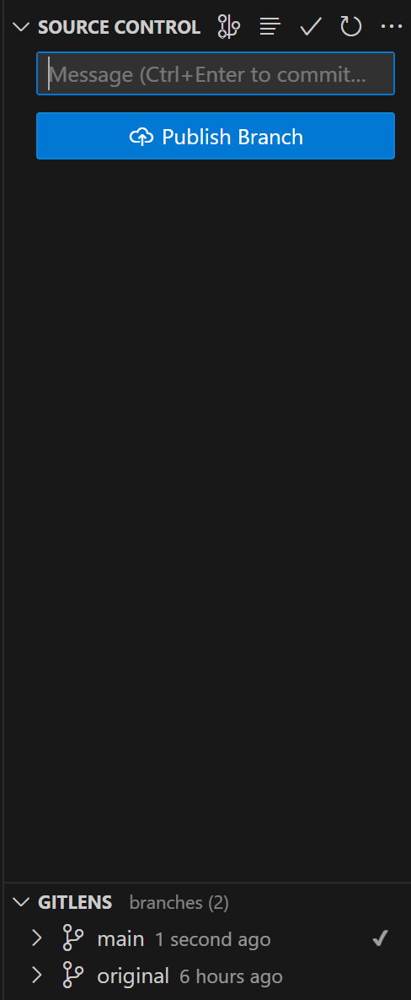

### 3. Names and Genders

1. Find the names and genders of all the main characters in the game. This is going to help the AI properly handle subjects and genders. For example:

   ```plaintext
   水無月 士乃 (Minazuki Shino) - Female
   怪盗エース (Phantom Thief Ace) - Female
   暗黒斎 (Dark Kokusai) - Male
   フトシ (Futoshi) - Male
   ```

   (Japanese first, followed by English in parentheses, followed by gender.)

2. Place this inside `vocab.txt` in the DazedMTLTool project under `# Game Characters`. Do your best to find as many characters as possible beforehand.

### 4. Non-Map Files

1. Translate the Non-Map files. By Non-Map files, we mean files inside `data` that aren't MapXXX or CommonEvents, such as Actors, Weapons, etc. To start, place these inside the `files` folder.
2. `files` will contain all the txt files that are to be translated. After the tool is run, the translated files will be placed inside `translated`.

   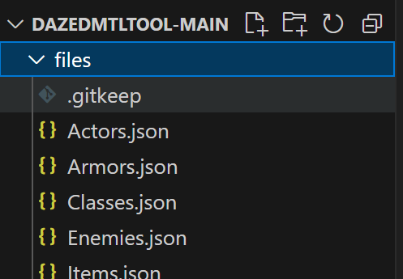
3. Open `start.py` by double-clicking it and then press F5. If prompted, select `Python Debugger` and `Python File`. This will start the tool, and you will be prompted.

   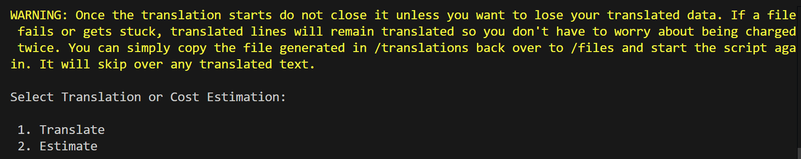
4. Enter `1` to select "Translate". Then enter `1` to select the rpgmakermvmz module. This will begin translation.
5. After it's finished, copy the files in `translation` back to the game `data` folder and check in-game to see if it's properly translated.

**Note:** You can check `translations.txt` to see what was translated and even paste that into `vocab.txt` to add extra context for locations or items. This will make the AI translate it consistently later on. However, the bigger the vocab file, the more expensive the process will be, and if it's too big, it might reduce the quality of the translation.

6. We can now commit these files as well to essentially save them. Back in the Game Project in VSCode, check the Source Control tab on the left. It is going to list all the changed files. If you click on one, it will show you the specific changes.

   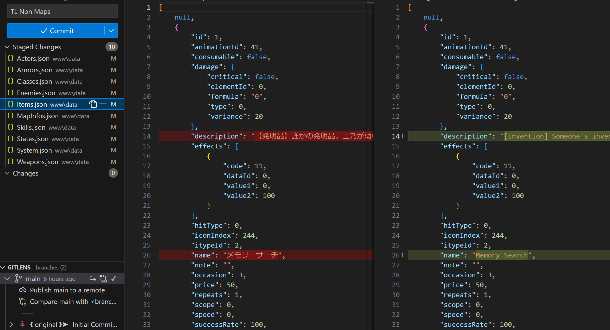
7. Commit/Save these changes by typing what the changes are in the message box and hitting `Commit`. The Gitlens tabs will show you all your commits, and you can go back and forth as needed.

   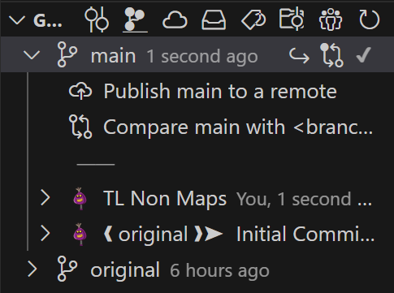

At any time, you can right-click a file and select `Open Changes` > `Open Changes w/ Branch` and select `original` to compare with the original files. Very useful.

### 5. Map Files

1. Now we can start translating the actual dialogue. I always recommend starting the game first and checking the first dialogue that appears. Then translate that map file. You can use the Snipping Tool to screenshot some text, grab it, and then use VSCode to search through the files.

   For example, this is the first line of this game:

   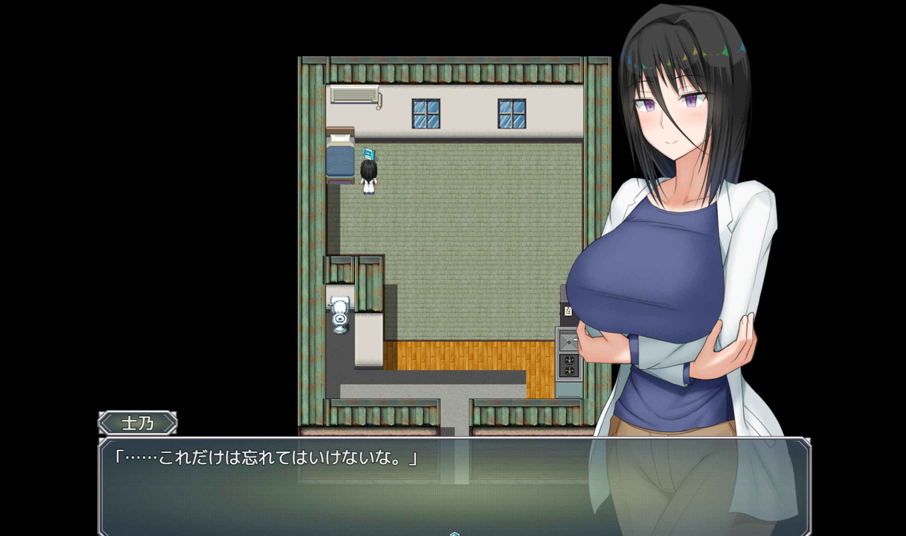

2. Use the Snipping Tool to screenshot and grab the text. Then go to the VSCode Game Project and search that text.

   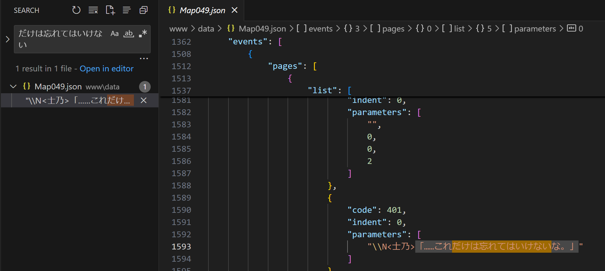
3. As you can see, Map049 is where the text resides. Copy that file to `files` in the tool.
4. Open `rpgmakermvmz.py` in VSCode by double-clicking it.
5. At the top of the module, there will be a lot of variables. What we mainly care about for this tutorial are the CODES. These codes label what the actual text is. For example:

   - 401 Code = Dialogue
   - 102 Code = Choices
   - 122 Code = Variables
   - etc.

   When a code is set to `True`, the tool will translate all instances of it in the game files. As a rule of thumb, 401, 405, and 102 will translate 95%+ of the game. This is what we are going to do. Make sure those codes are set to `True`, and the rest are set to `False`.

   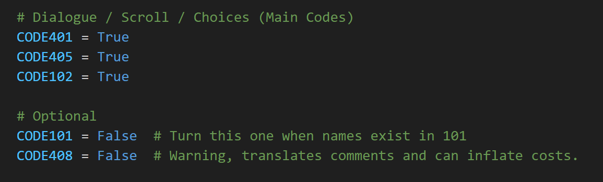

6. Next, look into `.env` and set the wordwrap for the text. Wordwrap will set how many words appear before a newline. No need to think too hard, just lower or raise it as needed in-game. 60 is a good fit for most games, and you can change it later by rerunning the map files through the tool.
7. Now we can finally translate, simply repeat the steps you did for the non-map files, and it should work.
8. Once you confirm that the text is translated and looks good in-game, you can then copy and paste the rest of the Map files into `files` and just run the tool. You can use `Estimate` to give you an estimate on the cost. Most games are around $20.

### 6. Plugin Files

You may notice that there is some text not translated in the menus. This text usually lives in `plugins.js`.

1. Navigate to the game project and search the text you are looking for. You can simply translate the text directly here as needed. This varies from game to game, but as long as you use the search functionality in VSCode, you should have no issues.

   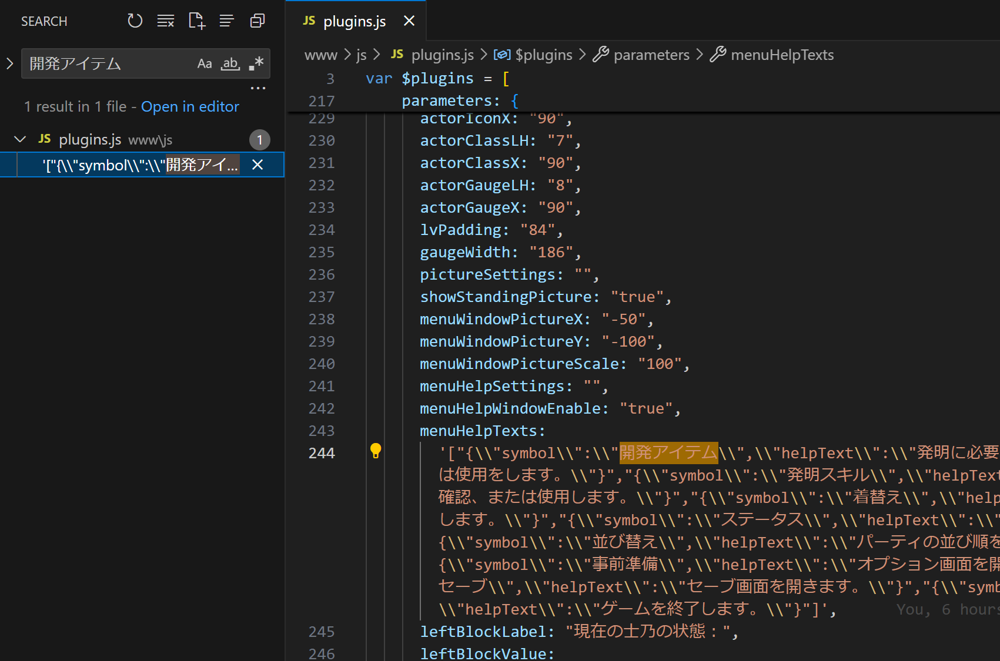

## Final Thoughts

That's about all the knowledge you need to get started on translation. RPGM games are easiest for this tool, but it can handle some other engines and most text files. The general process remains the same. Feel free to shoot me questions on Discord if you have trouble. Good luck!