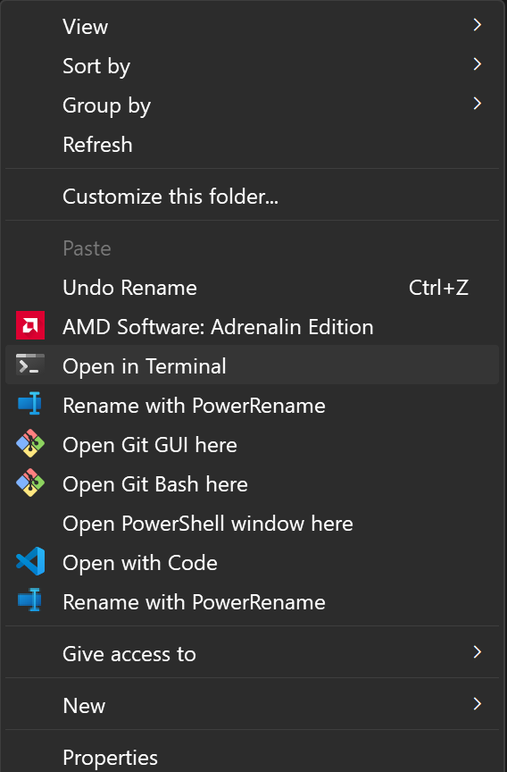

# Supported Engines
* RPGM Games
* Text Files
* Certain VN Engines (Renpy, Tyrano, Kirikiri, etc)

# Overview
This is a translation tool that can be used to translate games. Specifically you can translate text files from games and the tool will handle most of the hard work. There is no GUI interface at the moment, everything is done through the command line.

This tool mainly uses GPT for translation, but it can be configured with other models as long as they share the same format.

# Setup
Note that this will very likely require either a bit of programming experience or the motivation and time to learn.

## Tools
* [VSCode](https://code.visualstudio.com/) - Code Editor I use.
* [Python & Pip](https://www.python.org/downloads/) - Language. Google guides if pip isn't found in later steps.
* [Git](https://git-scm.com/) - Version Control. Will show you what has been changed. Amazing for translation.

## General Setup
1. Create a new folder where the tool will live.
2. Shift + Right Click and select Open in CMD or Terminal

