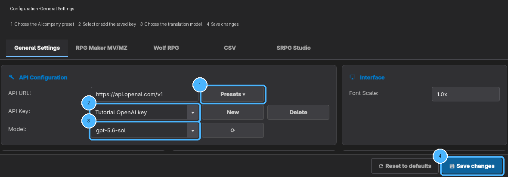

# Start Here

DazedTL helps turn Japanese game text into English with an online AI service. It works best with
**RPG Maker** and **WOLF RPG** games. You do not need to know programming.

## Read these pages first

Read the four pages under **DEFINITELY READ THESE** from top to bottom:

1. **Start Here**
2. **Set Up Your AI Helper**—required
3. **Set Up Git**—optional, but strongly recommended
4. **Full Translation Example**

Everything under **EXTRA INFORMATION** is optional. Open those pages when you need more detail or
have a problem. You do not need to memorize them.

## Before you begin

### Keep an untouched game

Make a copy of the entire game folder and never edit that copy. Work on a second copy instead. On
Windows, right-click the game folder, choose **Copy**, then **Paste** it somewhere with enough free
space.

The **game folder** is usually the folder containing `Game.exe`.

### Start DazedTL

On Windows, double-click `START.bat`. On Linux or macOS, use `START.sh` or the desktop shortcut. If
you are reading this inside DazedTL, it is already running.

The first start may take a while while DazedTL prepares what it needs. You normally do not need to
install or configure Python yourself.

### Add your translation key

An **API key** is a private password that lets DazedTL use an online AI company. Never share it or
include it in screenshots.

Open **Configuration → General Settings**. Choose the company under **Presets**, click **New** to
save its API key, choose a model, and click **Save changes**. The beginner choices in this version
are:

| Choice | Good for |
|---|---|
| **GPT-5.6 Sol** | Best translation quality; budget about $30 for an average full-game translation |
| **GPT-5.6 Terra** | Recommended paid option; best overall translation quality-to-cost balance and supports Batch jobs |
| **Claude Sonnet 4.6** | Lower-cost paid alternative; about 1.5× cheaper, with slightly lower average translation quality |
| **Mistral Medium 3.5** | Free option; use Normal translation mode |

Choose the **OpenAI** preset. Use **GPT-5.6 Sol** (`gpt-5.6-sol`) for the best quality, or
**GPT-5.6 Terra** (`gpt-5.6-terra`) for the recommended quality-to-cost balance. A full-game Sol
translation costs about **$30 on average**, but the actual total varies with the game's size and
retries. Choose **Claude (Anthropic)** when lower cost matters more than the small average quality
difference, or **Mistral** when you need the free option. Online translation may cost money, so the
example starts with one small map.

*In Configuration → General Settings, work through the four highlighted controls from left to
right. The key name is visible, but its secret stays hidden.*

## What you will do

1. Open the working game copy in DazedTL and your AI helper.
2. Let DazedTL copy out a small amount of game text.
3. Give the helper DazedTL's setup instructions.
4. Translate the small test.
5. Put the English back into the working game.
6. Play it, fix problems, and repeat with a little more text.

Continue to **Set Up Your AI Helper**.
