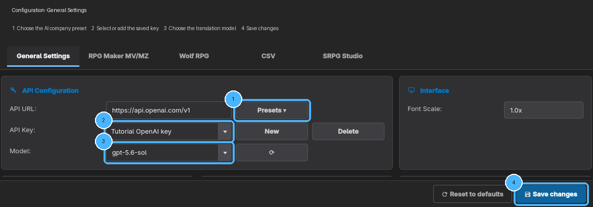

# Start Here

DazedTL helps turn Japanese game text into English with an online AI service. It works best with
**RPG Maker** and **WOLF RPG** games. You do not need to know programming.

## Read these pages first

Read the four pages under **Getting started** from top to bottom:

1. **Start Here**
2. **Set Up Your AI Helper**—required
3. **Set Up Git**—optional, but strongly recommended
4. **Full Translation Example**

Everything under **Reference** is optional. Open those pages when you need more detail or
have a problem. You do not need to memorize them.

## Before you begin

### Keep an untouched game

Make a copy of the entire game folder and never edit that copy. Work on a second copy instead. On
Windows, right-click the game folder, choose **Copy**, then **Paste** it somewhere with enough free
space.

The **game folder** is usually the folder containing `Game.exe`.

### Start DazedTL

On Windows, double-click `START.bat`. On macOS, open `START.command`. On Linux, run
`bash START.sh` or use the desktop shortcut. If
you are reading this inside DazedTL, it is already running.

The first start may take a while while DazedTL prepares what it needs. You normally do not need to
install Python, Node, npm or Qt yourself. The first launch needs internet; later launches reuse
the private runtimes.

Upgrading from the old Qt app: click **Update**, close the app when it finishes, and open it again
with the same launcher. Your settings and saved work are imported automatically. Open **Recent**
for the migration report. Original files and logs stay in the old installation folder; migration
does not start translation or resume paid jobs. Future updates are under **Updates & rollback**.

### Add your translation key

An **API key** is a private password that lets DazedTL use an online AI company. Never share it or
include it in screenshots.

Open **Settings → Provider**. Choose the company under **Presets**, enter and **Save credential**,
choose a model, and click **Save settings**. The beginner choices in this version
are:

| Choice | Good for |
|---|---|
| **GPT-5.6 Sol** | Best translation quality; budget about $30 for an average full-game translation |
| **GPT-5.6 Terra** | Recommended paid option; best overall translation quality-to-cost balance, efficient caching, and Batch support |
| **Claude Sonnet 5** | Paid alternative; slightly lower average translation quality and about 1.5× the token usage |
| **Mistral Medium 3.5** | No-cost option through Mistral Free mode; use Normal translation mode |

For most users, choose the **OpenAI** preset. Its models have a small average translation-quality
edge over Claude in DazedTL, and OpenAI's caching works more efficiently with the tool. Use
**GPT-5.6 Sol** (`gpt-5.6-sol`) for the best quality, or **GPT-5.6 Terra** (`gpt-5.6-terra`) for the
recommended quality-to-cost balance. A full-game Sol translation costs about **$30 on average**,
but the actual total varies with the game's size and retries.

Choose **Claude (Anthropic)** if you prefer Anthropic, but keep in mind that its models typically
use about **1.5× as many tokens** in DazedTL and are not generally the cheaper option after caching
and token usage are included. Choose **Mistral Free mode** when you need the no-cost option. Online
translation may cost money, so the example starts with one small map.

*This screenshot shows the previous Qt interface. In the new app, use Settings → Provider
for the same provider, credential and model choices. The secret stays hidden.*

## What you will do

1. Open the working game copy in DazedTL and your AI helper.
2. Let DazedTL copy out a small amount of game text.
3. Give the helper DazedTL's setup instructions.
4. Translate the small test.
5. Put the English back into the working game.
6. Play it, fix problems, and repeat with a little more text.

Continue to **Set Up Your AI Helper**.
