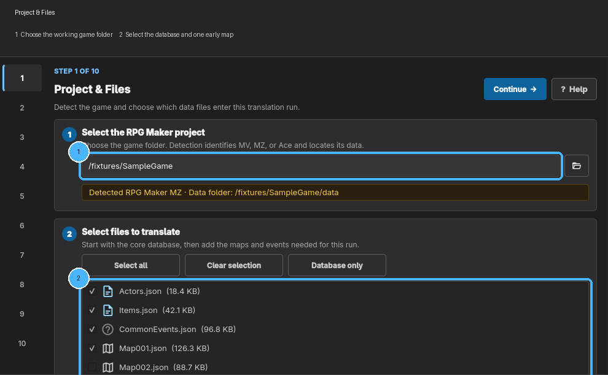
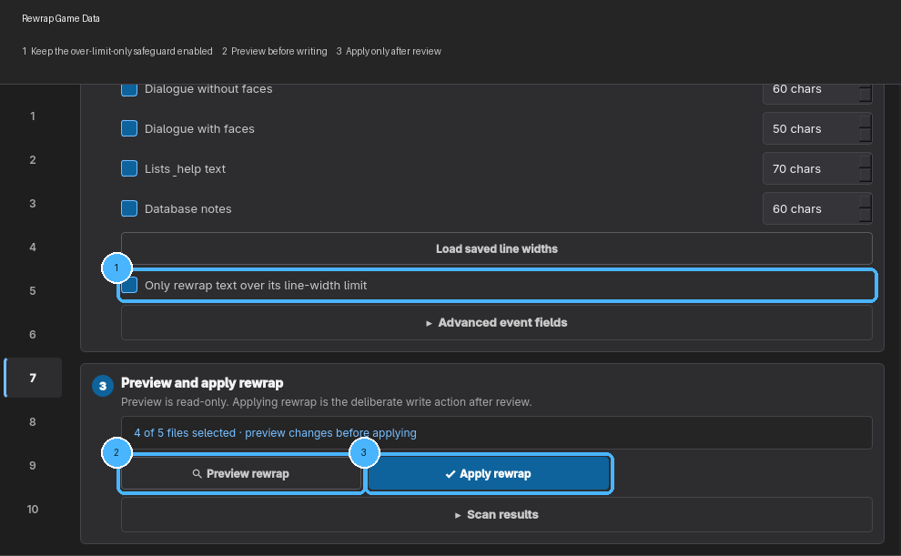

# RPG Maker Steps

Open **Workflow** and choose **RPG Maker**. Work from the top step to the bottom step. The **?**
button on each page explains the controls on that page.

Use **Back** and **Continue** at the bottom. The **Activity** button shows progress messages and
errors.

## What each step does

| Step | In plain language |
|---|---|
| **0 Project** | Choose the game and the text you want to work on |
| **1 Prepare** | Optional cleanup tools; beginners can usually skip this |
| **2 Setup** | Save character names and instructions for the translator |
| **3 Phase 1** | Translate normal game information and dialogue |
| **4 Phase 2** | Translate harder text hidden in events and add-ons; leave this until later |
| **5 Export** | Put reviewed translations back into the game |
| **6 Rewrap** | Fix lines that are too wide, check for problems, and make a ZIP to share |
| **7 Images** | Translate words that are part of pictures (MV/MZ only) |
| **8 Playtest** | Install optional tools that help find text while playing (MV/MZ only) |

## A safe first test

1. In Step 0, choose the folder containing `Game.exe`.
2. Select the main game information and one early map, such as `Map001.json`.
3. In Step 2, click **Collect names** first. Then copy the setup instructions into your AI helper.
   If it marks an extra speaker option **ENABLE**, turn it on and collect names again.
4. In Step 3, translate the main game information and dialogue.
5. In Step 5, use **Export selected files**.
6. Start the game and test that map.

Only select the rest of the maps after this test looks good.

## Name options in Step 2

DazedTL shows options named **INLINE401**, **FIRSTLINE**, and **FACENAME**. These are extra places
where RPG Maker games may store a speaker's name. Click **Collect names** before worrying about
them. Then run the setup instructions with your AI helper. In its **speakers** result, turn on only
the options marked **ENABLE** and click **Collect names** again. Many games do not need any of them.

## Normal mode or Batch mode?

- Use **Normal** for your first test or a few files. You see the result sooner.
- Use **Batch** for a large amount of text when your selected AI service supports it. It may be
  cheaper, but it takes longer and is not available with every service.

## Step 4: harder text

Leave **Phase 2** alone until the normal dialogue works. This step can contain words the game uses
as instructions rather than words shown to the player. Translating the wrong one can break the
game.

When you are ready, click **Copy advanced-text audit** and paste those instructions into your AI
helper. Turn on only the items it confirms are player-visible text.

## Step 6: text that does not fit

English often takes more space than Japanese. **Rewrap** changes where a line breaks so it fits in
the message box.

1. Export the translation in Step 5 first.
2. In Step 6, choose the kind of text and the files you want to check. **Select all** checks the
   entire game.
3. Leave **Only rewrap text over its line-width limit** on to preserve text that already fits, then
   scan and preview every over-limit line.
4. Apply the reviewed fixes. Turn that option off only when you deliberately want to reflow all
   selected text.
5. Start the game and test again.

The extra settings are for unusual games. Leave their default values alone on your first pass.

## Step 7: words inside pictures

Some menus and signs are pictures rather than normal text. Click **Open Image Manager**, make an
editable copy of the pictures you want, then click **Copy skill**. Give those instructions to your
AI helper and review every edited picture before clicking **Patch selected** or **Patch all**.

For difficult image work, DazedTL recommends Codex with **GPT-5.6 Sol** when it is available.
Smaller models may be fine for plain signs or buttons, but can struggle with small text, stylized
fonts, and crowded layouts.

DazedTL keeps backups, but you should still keep your own untouched copy of the game.

## Note for RPG Maker Ace

Ace stores some menu text differently from MV and MZ. DazedTL handles the unpacking and packing
from Steps 0 and 5. If you need to edit menu or script text, follow the instructions shown in Step
5 and use your AI helper. Normal dialogue still uses the same translation steps above.
